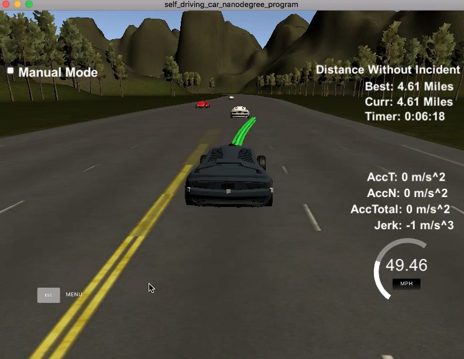

# CarND-Path-Planning-Project
Self-Driving Car Engineer Nanodegree Program

## Kerem Par
<kerempar@gmail.com>


---
   
### Simulator.
You can download the Term3 Simulator which contains the Path Planning Project from the [releases tab (https://github.com/udacity/self-driving-car-sim/releases).

### Goals
In this project your goal is to safely navigate around a virtual highway with other traffic that is driving +-10 MPH of the 50 MPH speed limit. You will be provided the car's localization and sensor fusion data, there is also a sparse map list of waypoints around the highway. The car should try to go as close as possible to the 50 MPH speed limit, which means passing slower traffic when possible, note that other cars will try to change lanes too. The car should avoid hitting other cars at all cost as well as driving inside of the marked road lanes at all times, unless going from one lane to another. The car should be able to make one complete loop around the 6946m highway. Since the car is trying to go 50 MPH, it should take a little over 5 minutes to complete 1 loop. Also the car should not experience total acceleration over 10 m/s^2 and jerk that is greater than 10 m/s^3.

#### The map of the highway is in data/highway_map.txt
Each waypoint in the list contains  [x,y,s,dx,dy] values. x and y are the waypoint's map coordinate position, the s value is the distance along the road to get to that waypoint in meters, the dx and dy values define the unit normal vector pointing outward of the highway loop.

The highway's waypoints loop around so the frenet s value, distance along the road, goes from 0 to 6945.554.

## Basic Build Instructions

1. Clone this repo.
2. Make a build directory: `mkdir build && cd build`
3. Compile: `cmake .. && make`
4. Run it: `./path_planning`.

Here is the data provided from the Simulator to the C++ Program

#### Main car's localization Data (No Noise)

["x"] The car's x position in map coordinates

["y"] The car's y position in map coordinates

["s"] The car's s position in frenet coordinates

["d"] The car's d position in frenet coordinates

["yaw"] The car's yaw angle in the map

["speed"] The car's speed in MPH

#### Previous path data given to the Planner

//Note: Return the previous list but with processed points removed, can be a nice tool to show how far along
the path has processed since last time. 

["previous_path_x"] The previous list of x points previously given to the simulator

["previous_path_y"] The previous list of y points previously given to the simulator

#### Previous path's end s and d values 

["end_path_s"] The previous list's last point's frenet s value

["end_path_d"] The previous list's last point's frenet d value

#### Sensor Fusion Data, a list of all other car's attributes on the same side of the road. (No Noise)

["sensor_fusion"] A 2d vector of cars and then that car's [car's unique ID, car's x position in map coordinates, car's y position in map coordinates, car's x velocity in m/s, car's y velocity in m/s, car's s position in frenet coordinates, car's d position in frenet coordinates. 

## Details

1. The car uses a perfect controller and will visit every (x,y) point it recieves in the list every .02 seconds. The units for the (x,y) points are in meters and the spacing of the points determines the speed of the car. The vector going from a point to the next point in the list dictates the angle of the car. Acceleration both in the tangential and normal directions is measured along with the jerk, the rate of change of total Acceleration. The (x,y) point paths that the planner recieves should not have a total acceleration that goes over 10 m/s^2, also the jerk should not go over 50 m/s^3. (NOTE: As this is BETA, these requirements might change. Also currently jerk is over a .02 second interval, it would probably be better to average total acceleration over 1 second and measure jerk from that.

2. There will be some latency between the simulator running and the path planner returning a path, with optimized code usually its not very long maybe just 1-3 time steps. During this delay the simulator will continue using points that it was last given, because of this its a good idea to store the last points you have used so you can have a smooth transition. previous_path_x, and previous_path_y can be helpful for this transition since they show the last points given to the simulator controller with the processed points already removed. You would either return a path that extends this previous path or make sure to create a new path that has a smooth transition with this last path.

## Tips

A really helpful resource for doing this project and creating smooth trajectories was using http://kluge.in-chemnitz.de/opensource/spline/, the spline function is in a single hearder file is really easy to use.

---

## Dependencies

* cmake >= 3.5
  * All OSes: [click here for installation instructions](https://cmake.org/install/)
* make >= 4.1
  * Linux: make is installed by default on most Linux distros
  * Mac: [install Xcode command line tools to get make](https://developer.apple.com/xcode/features/)
  * Windows: [Click here for installation instructions](http://gnuwin32.sourceforge.net/packages/make.htm)
* gcc/g++ >= 5.4
  * Linux: gcc / g++ is installed by default on most Linux distros
  * Mac: same deal as make - [install Xcode command line tools]((https://developer.apple.com/xcode/features/)
  * Windows: recommend using [MinGW](http://www.mingw.org/)
* [uWebSockets](https://github.com/uWebSockets/uWebSockets)
  * Run either `install-mac.sh` or `install-ubuntu.sh`.
  * If you install from source, checkout to commit `e94b6e1`, i.e.
    ```
    git clone https://github.com/uWebSockets/uWebSockets 
    cd uWebSockets
    git checkout e94b6e1
    ```

---

## Compilation

The code compiles correctly. Code compiles without errors with `cmake` and `make`.

---

## Valid Trajectories

It is observed that the following conditions are met during the tests on the simulator environment:

The car is able to drive at least 4.32 miles without incidents such as exceeding acceleration/jerk/speed, collision, and driving outside of the lanes. 

The car drives according to the speed limit. The car doesn't drive faster than the speed limit. Also the car isn't driving much slower than speed limit unless obstructed by traffic.

Max Acceleration and Jerk are not Exceeded. The car does not exceed a total acceleration of 10 m/s^2 and a jerk of 10 m/s^3.

Car does not have collisions. The car does not come into contact with any of the other cars on the road.

The car stays in its lane, except for the time between changing lanes.  The car doesn't spend more than a 3 second length outside the lane lines during changing lanes, and every other time the car stays inside one of the 3 lanes on the right hand side of the road.

The car is able to change lanes. The car is able to smoothly change lanes when it makes sense to do so, such as when behind a slower moving car and an adjacent lane is clear of other traffic.

---

## Implementation

The code model for generating paths is described in detail.

A path planner that performs optimized lane changing was created. This means that the car only changes into a lane that improves its forward progress.

As the starting point the code and instructions given in `Project Walkthrough and Q&A` section of the project descriptions were adapted. 

The reference velocity is initially set to 0 and increased gradually (.224 mph per time interval) to prevent exceeding the max accelaration limit to a maximum of 49.5 mph to prevent exceeding the max speed limit.

For each time step, it is checked if there is a car in front of the ego vehicle at the same lane and based on the velocities, if there is a safe gap (30m) between the vehicles. If we will keep the lane, then we reduce the reference velcoity gradually (.224 mph per time interval).   

Then lane change logic was improved to be able to propose lane changes from any lane to any lane and to enable safe lane changes. If the car is too close to a slower car in front of it (less than 30m), a lane change is proposed based on the following table:   

| Current Lane |  Proposed New Lane  | 
| ----- | ------- |
|  0    |  1 (right) | 
|  1    |  0 (left)  | 
|  1    |  2 (right)  - if changing left is not safe| 
|  2  | 1 (left) | 

Then, the proposed lane change is checked if it is safe or not by a method named `isLaneChangeSafe`. The method iterates over all the cars in the sensor fusion data. It first checks if a car is going on the same lane as the proposed new lane, Then, based on its velocity, it is checked if there would be a safe gap (30m) between the car and the ego vehicle (either in front of or behind the ego vehicle) when the lane change occures. If this is the case, the proposed lane change is executed by setting the destination waypoint of the path to be on the new lane.  

On the other hand, the trajectory generation is performed as follows:

We define a path made up of (x,y) points that the car will visit sequentially every .02 seconds. First, we create a list of widely spaced (x,y) waypoints, evenly spaced at 30m. In Frenet we add three evenly 30m spaced points (at 30m, 60m and 90m) ahead of the starting reference. Then we create a spline interpolating these waypoints. Then we define the actual (x,y) points we will use for the planner by breaking up spline points so that we travel at our desired reference velocity. We always output 50 points.

The following is a sample image captured from the simulator:



In addition, a video was also included covering a 5 miles travel of the car showing many lane change manouvers. 
